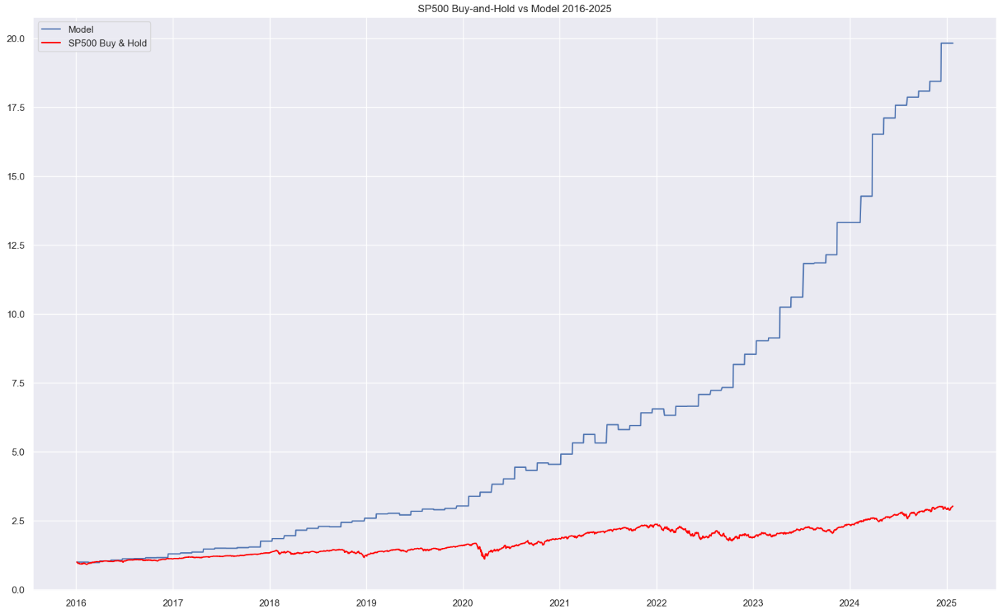
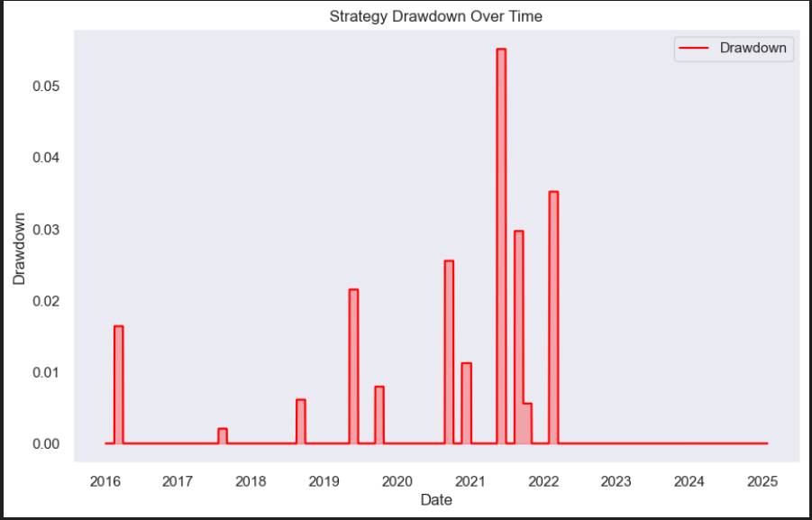

# Cointegration-Based Stock Trading Strategy

This project implements a **pairs trading strategy** using **Engle-Granger cointegration tests** to identify cointegrated stock pairs among the **top 50 S&P 500 companies**. The strategy incorporates **LSTM models** to predict spread movements and optimize trading decisions.

## 1. **Data Collection:**
   - **Loaded ticker data** for each company in the S&P 500 using **yfinance**.
   - **Fetched data** for the **top 50 companies** based on market capitalization using **yfinance**.
   - **Loaded OHLC (Open, High, Low, Close) prices** for **SPY** and each S&P 500 ticker using **yfinance**.

## 2. **Strategy:**
   - For each **cointegrated pair**, predicted the **spread** 30 days in advance.
   - **Calculated the difference** between the predicted spread and the current spread.
   - **Trading logic**:
     - **Short position**: If the difference is greater than **0.5 * 30-day SMA** of the standard deviation of the positive difference.
     - **Long position**: If the difference is less than **-0.5 * 30-day SMA** of the standard deviation of the negative difference.
     - **Neutral position**: If the difference is within the defined range.

## 3. **Cointegration Test:**
   - Conducted **Engle-Granger cointegration tests** on the **top 50 biggest companies based on market cap**.
   - Selected **top 10 cointegrated pairs**.

## 4. **Training LSTM Model:**
   - **Indicators used**: Spread, 30-day spread difference, spread RSI ratio, and spread MACD, spread SMA ratio.
   - **Predictor variables**: Normalized current and 30-day lagged indicators.
   - **Response variable**: "Signal" – 1 (long), 0 (neutral), -1 (short).
   - **Training period**: From **3/1/2005 to 31/12/2015**.
   - **Epochs**: Trained each pair for 15 epochs.

## 5. **LSTM Architecture:**
   - **Input layer**: Dimensions (30, 5).
   - **LSTM layer**: 128 neurons with **ReLU activation**.
   - **Output layer**: Dimensions (3,), **linear activation**.
   - **Optimizer**: **Adam optimizer**.

## 6. **Making Predictions:**
   - Predicted the **signal** for each pair.
   - **Rebalanced the portfolio** every **30 days** based on the predicted signals.

## 7. **Performance Metrics:**

| Metric                         | Our Strategy (Jan 2016 - Dec 2020) | Our Strategy (Jan 2016 - Jan 25, 2025) | S&P 500 (Jan 2016 - Dec 2020) | S&P 500 (Jan 2016 - Jan 25, 2025) |
|---------------------------------|----------------------------------|------------------------------------|------------------------------|-----------------------------------|
| **Annual Fee**                  | 2.00%                            | 2.00%                              | 2.00%                        | 2.00%                             |
| **After-Fee Total Return**      | 320.43%                          | 1568.03%                           | 75.43%                       | 185.14%                           |
| **Annualized Return**           | 35.40%                           | 39.13%                             | 13.14%                       | 13.11%                            |
| **After-Fee Annualized Return** | 33.30%                           | 36.50%                             | 11.90%                       | 12.35%                            |
| **Maximum Drawdown**            | -2.55%                           | -5.52%                             | -33.92%                      | -33.92%                           |
| **Total Return**                | 354.46%                          | 1882.36%                           | 85.43%                       | 203.14%                           |
| **Average Daily Return**        | 0.12%                            | 0.14%                              | 0.0565%                      | 0.0552%                           |
| **Volatility (Standard Deviation of Returns)** | 0.98%           | 1.08%                              | 1.2115%                      | 1.1362%                           |

 

